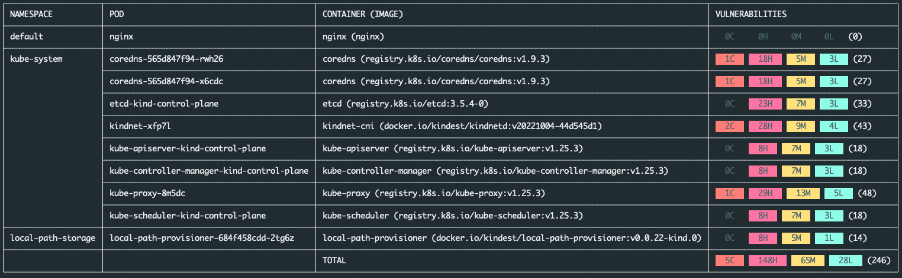

# Skout

With skout, you can get a bird's eye view of the number of Common Vulnerabilities and Exposures (CVEs) detected in the container images running on your Kubernetes cluster, all thanks to [Docker Scout](https://docs.docker.com/scout/).



> **Note**
>
> `skout` uses [Docker Scout](https://docs.docker.com/scout/) which is an early access product at the time of writing.

## Recommended requirements

It's highly recommended to have [Docker Desktop](https://www.docker.com/products/docker-desktop/) 4.17 or higher as `skout` will be using the `docker scout` CLI plugin that is shipped with that version of Docker Desktop.

However, if Docker Desktop is not present or the version is lower than 4.17, will be using the image `docker/scout-cli` to analyze the images running in the Kubernetes cluster.
Note that the analysis will take longer as we'll be running `docker scout` in a container instead of using the CLI that comes with Docker Desktop 4.17 or higher.  If that's the case, make sure to provide `DOCKER_SCOUT_HUB_USER` and `DOCKER_SCOUT_HUB_PASSWORD` as environment variables to provide such values within the container where docker scout runs.


## Getting started

If you don't have a Kubernetes cluster, you can enable the one that comes with Docker Desktop or create quickly one
with [KinD](https://kind.sigs.k8s.io/): `kind create cluster`.

Go to the [releases](https://github.com/felipecruz91/skout/releases) page and download the `skout` binary for your platform, for instance:

```shell
curl -LsO https://github.com/felipecruz91/skout/releases/download/0.0.3/skout_0.0.3_darwin_amd64.tar.gz
tar -xvzf skout_0.0.3_darwin_amd64.tar.gz
sudo mv skout /usr/local/bin/skout
```

### Detect vulnerabilities across all the namespaces

```shell
skout 
```

### Detect vulnerabilities in the `default` namespace

```shell
skout --namespace default
```

### Passing options to the analysis

You can specify in `skout` the options defined in `docker scout cves -h` to customize the report, for instance:

```shell
skout --namespace default --ignore-base --only-fixed
```

## How does it work?

`skout` is a CLI built in Go that connects to a Kubernetes cluster by using a `kubeconfig` file (default `~/.kube/config`). Use the `-kubeconfig` flag to specify a different location of the `kubeconfig` file if required.

It uses the Kubernetes Go SDK to retrieve the list of container images that are running in the cluster (or in a given namespace if `-namespace` is set). Then, it runs `docker scout` on every image to find out the number of vulnerabilities (critical, high, medium and low). Finally, `skout` displays the vulnerability information in a table format for easy viewing and analysis.
## Why could this be useful?

Ideally, you would do image vulnerability scanning as part of your CI/CD pipeline to prevent container images being deployed to your Kubernetes cluster according to a customizable threshold. An image may have 0 CVEs when it's first deployed to your cluster, however, new CVEs can surface over time and long-lived workloads that are not updated/patched regularly will become vulnerable eventually.

With `skout` you can get a feel of how good or bad your Kubernetes cluster's workloads perform in terms of number of CVEs *at runtime*.  This can help users identify any security issues in their Kubernetes cluster, such as what images have the most vulnerabilities, and take appropriate actions to mitigate them with `docker scout` eventually.
